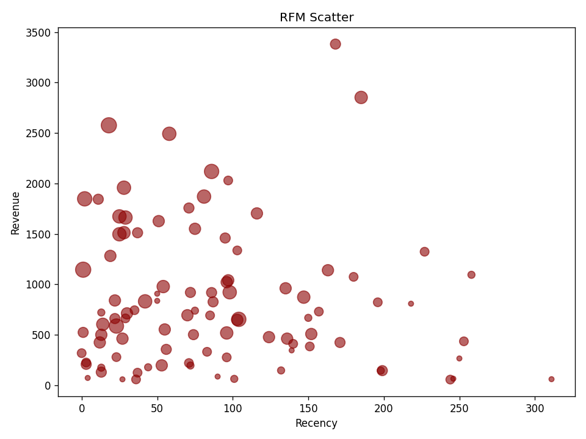
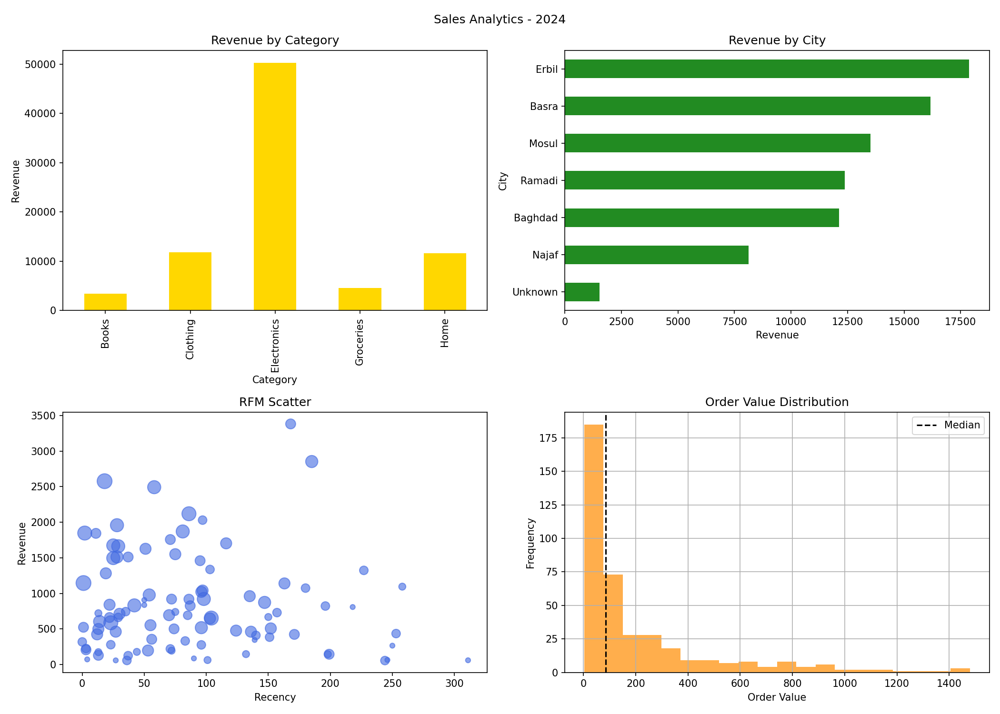

# Retail Sales Analytics Project

**Author:** Ahmed Alkohly
**Role:** Junior Python Backend & Data Engineer

## Overview

This project analyzes retail sales data using Python, Pandas, NumPy, and Matplotlib.

The project includes data cleaning, feature engineering, sales KPI analysis, category and city revenue analysis, RFM customer segmentation, dashboard visualization, and CSV report generation.

## Project Goal

The main goal of this project is to analyze retail sales data and extract useful business insights such as total revenue, customer behavior, category performance, city performance, and customer segmentation.

## Business Questions

This project answers the following questions:

* What is the total revenue?
* How many orders, customers, and categories are in the dataset?
* What is the average order value?
* What is the median order value?
* Which category has the highest quantity sold?
* Which category generates the highest revenue?
* How is revenue distributed across categories?
* How is revenue distributed across cities?
* Who are the VIP customers?
* Which customers may be at churn risk?

## Dataset

The dataset is stored in:

```text
sales.csv
```

Main columns:

```text
order_id
date
customer_id
city
category
quantity
unit_price
```

## Tools Used

* Python
* Pandas
* NumPy
* Matplotlib
* PyCharm

## Project Workflow

### 1. Data Loading

The project loads the sales dataset from a CSV file using Pandas.

### 2. Data Cleaning

The cleaning process includes:

* Removing duplicated rows.
* Filling missing city values with `Unknown`.
* Standardizing city names.
* Removing negative quantity records.
* Filling missing unit prices using the median unit price of each category.

### 3. Feature Engineering

New columns were created to support the analysis:

* `revenue`
* `month`
* `weekday`

### 4. Sales KPI Analysis

The project calculates important sales metrics such as:

* Total revenue
* Number of orders
* Number of customers
* Number of categories
* Average order value
* Median order value
* Top category by quantity
* Top category by revenue

### 5. Revenue Share Analysis

The project analyzes revenue distribution by:

* Product category
* City

### 6. RFM Customer Segmentation

RFM analysis was used to segment customers based on:

* **R - Recency:** How recently the customer made a purchase.
* **F - Frequency:** How often the customer made purchases.
* **M - Monetary:** How much revenue the customer generated.

The project identifies:

* VIP customers
* Customers at churn risk

## Visualizations

### RFM Scatter Plot


### Sales Dashboard



## Project Structure

```text
sales-data-analysis-python/
│
├── data_project.py
├── sales.csv
├── README.md
├── requirements.txt
│
├── outputs/
│   ├── rfm_scatter_ahmed.png
│   └── final_dashboard_ahmed.png

## How to Run

Install the required libraries:

```bash
pip install -r requirements.txt
```

Run the project:

```bash
python data_project.py
```

After running the script, the project will generate:

* Charts inside the `outputs` folder.
* CSV reports inside the `reports` folder.

## Key Skills Demonstrated

* Python programming
* Data cleaning
* Feature engineering
* Exploratory Data Analysis
* Business KPI analysis
* RFM customer segmentation
* Data visualization
* CSV report generation
* Project organization for GitHub

## Conclusion

This project demonstrates the ability to analyze sales data, clean and prepare datasets, calculate business metrics, visualize insights, and segment customers using RFM analysis.

It is suitable as a portfolio project for junior roles in data analysis, Python development, and backend/data-focused positions.
